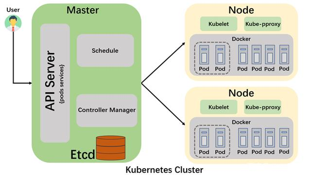
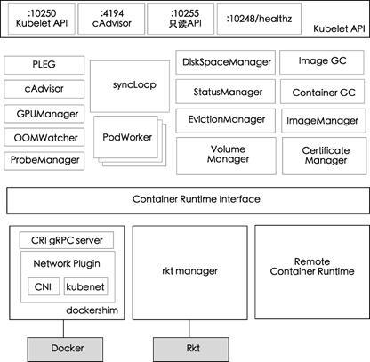

# Kubernetes组成

Kubernetes集群由两大部分组成：控制平面和实际运行普通应用的工作节点（或负载节点），其中经常把控制平面所在的节点叫Master节点。

## 控制平面组件

### API Server

负责对外提供RESTful的kubernetes API 的服务，它是系统管理指令的统一接口（用户已经K8s自身的其他组件都是统一通过*apiserver*进行通行的）。kubectl(kubernetes提供的客户端工具，该工具内部是对kubernetes API的调用）是直接和apiserver交互的。运行方式一般是在容器中运行。

### Schedule

负责调度Pod到合适的Node上，如果把Scheduler看成一个黑匣子，那么它的输入是Pod和由多个Node组成的列表，输出是Pod和一个Node的绑定。kubernetes目前提供了调度算法，同样也保留了接口。用户可以根据自己的需求自定义调度算法。运行方式一般是在容器中运行。

### Controller-manager

如果APIserver做的是前台的工作的话，那么Controller-manager就是负责后台的。每一个资源都对应一个控制器。而control manager就是负责管理这些控制器的。运行方式一般是在容器中运行。

### Etcd

Etcd是一个高可用的键值存储系统，kubernetes使用它来存储各个资源的状态，从而实现了Restful的API。运行方式一般是在容器中运行。

## 负载节点组件

### Kublet

在kubernetes集群中，Kublet是**控制平面**在每个Node节点上面的agent，所以每个节点都要运行一个Kubelet服务进程，默认监听*10250*端口，接收并执行**控制平面**的指令，它负责管理该节点上的所有Pod及Pod中的容器（但是如果容器不是kubernetes创建的，它并不会管理）。每个Kubelet进程会向*控制平面*注册其所在节点的信息，定期向*控制平面*汇报该节点的资源使用情况，并通过**cAdvisor**监控节点和容器的资源。本质上，它负责使Pod的运行状态与期望的状态一致。运行方式一般是荣容器运行时一样直接运行在宿主机中。

在kubernetes集群中，每个Node节点上都运行一个Kubelet服务进程，默认监听10250端口，接收并执行Master发来的指令，管理Pod及Pod中的容器。每个Kubelet进程会在API Server上注册所在Node节点的信息，定期向Master节点汇报该节点的资源使用情况，并通过cAdvisor监控节点和容器的资源。

#### Kubelet内部结构

如下kubelet内部组件结构图所示，Kubelet由许多内部组件构成：

1. **Kubelet API：**包括 10250 端口的认证 API、4194 端口的 cAdvisor API、10255端口的只读API以及10248端口的健康检查 API。
2. **syncLoop：**从API或者manifest 目录接收 Pod 更新，发送到podWorkers处理，大量使用channel处理来处理异步请求。
3. **辅助的manager：**如cAdvisor、PLEG、Volume Manager等，处理syncLoop以外的其他工作。
4. **CRI**：容器执行引擎接口，负责与container runtime shim通信。
5. **容器执行引擎：**如dockershim、rkt 等（注：rkt 暂未完成CRI的迁移）。
6. **网络插件：**目前支持CNI和kubenet。

#### 了解Kubelet

##### 节点管理

节点管理主要是节点自注册和节点状态更新：

Kubelet可以通过设置启动参数`--register-node`来确定是否向API Server注册自己。如果Kubelet没有选择自注册模式，则需要用户自己配置Node资源信息，同时需要将API Server的位置告知Kubelet。自注册模式下，Kubelet在启动时通过 API Server 注册节点信息，并定时向 API Server 发送节点新消息，API Server在接收到新消息后，将信息写入Etcd中。

##### Pod管理

Kubelet以PodSpec的方式工作，PodSpec 是描述一个 Pod 的YAML或JSON对象。kubelet接受各种机制提供的PodSpecs（主要通过apiserver），并确保这些PodSpecs中描述的Pod正常健康运行。

向Kubelet提供PodSpecs的方法：

**文件：**启动参数--config指定的配置目录下的文件 (默认/ etc/kubernetes/manifests/)。该文件每 20 秒重新检查一次（可配置）。

**HTTP endpoint (URL)：**启动参数--manifest-url设置。每20秒检查一次这个端点（可配置）。

**API Server：**通过API Server监听Etcd目录，同步Pod清单。Kubelet 通过API Server Client(Kubelet启动时创建)使用Watch加List的方式监听"/registry/nodes/$当前节点名"和“/registry/pods”目录，将获取的信息同步到本地缓存中。Kubelet监听Etcd，所有针对Pod的操作都将会被Kubelet监听到。如果发现有新的绑定到本节点的Pod，则按照Pod清单的要求创建该Pod。如果发现本地的Pod被修改，则Kubelet会做出相应的修改，比如删除Pod中某个容器时，则通过Docker Client删除该容器。 如果发现删除本节点的Pod，则删除相应的Pod，并通过Docker Client删除Pod中的容器。

**HTTP server：**kubelet 侦听 HTTP请求，并响应简单的API以提交新的Pod清单。

##### Pod 启动流程

启动流程如下：

1）、用户通过Kubectl或其他API客户端提交Pod spec给API Server；

2）、API Server尝试着将Pod对象的相关信息存入Etcd中，待写入操作执行完成，API Server即会返回确认信息至客户端；

3）、API Server开始反映Etcd中的状态变化；

4）、所有的Kubernetes组件均使用Watch机制来跟踪检查API Server上的相关变动；

5）、Kube-scheduler通过其Watch觉察到API Server创建了新的Pod对象但尚未绑定至任何工作节点

6）、Kube-scheduler为Pod对象挑选一个工作节点并将结果信息更新至API Server；

7）、调度结果信息由API Server更新至Etcd，而且API Server也开始反映此Pod对象的调度结果；

8）、Pod被调度到目标工作节点上的kubelet尝试在当前节点上调用Docker启动容器，并将容器的结果状态回送至API Server；

9）、API Server将Pod状态信息存入Etcd中；

10）、在Etcd确认写入操作成功完成后，API Server将确认信息发送至相关的Kubelet，时间将通过它被接受。

**3、容器健康检查**

Pod通过两类探针检查容器的健康状态:

**(1) LivenessProbe（存活探针）探针**：用于判断容器是否健康，告诉Kubelet一个容器什么时候处于不健康的状态。如果LivenessProbe探针探测到容器不健康，则Kubelet 将删除该容器，并根据容器的重启策略做相应的处理。

**(2)ReadinessProbe（就绪探针）探针：**用于判断容器是否启动完成且准备接收请求。如果ReadinessProbe探针探测到失败，则Pod的状态将被修改。

Kubelet定期调用容器中的LivenessProbe探针来诊断容器的健康状况。LivenessProbe包含如下三种实现方式：

**ExecAction：**在容器内部执行一个命令，如果该命令的退出状态码为 0，则表明容器健康；

**TCPSocketAction：**通过容器的IP地址和端口号执行TCP检查，如果端口能被访问，则表明容器健康；

**HTTPGetAction：**通过容器的IP地址和端口号及路径调用HTTP GET方法，如果响应的状态码大于等于200且小于400，则认为容器状态健康。

LivenessProbe和ReadinessProbe探针包含在Pod定义的某个主容器中。

**4、Kubelet驱逐**

Kubelet会监控资源的使用情况，并使用驱逐机制防止计算和存储资源耗尽。在驱逐时，Kubelet将Pod的所有容器停止，并将PodPhase设置为Failed。

**5、cAdvisor资源监控**

cAdvisor是一个开源的分析容器资源使用率和性能特性的代理工具，集成到Kubele中，当Kubelet启动时会同时启动cAdvisor，且一个cAdvisor只监控一个Node节点的信息。cAdvisor自动查找所有在其所在节点上的容器，自动采集CPU、内存、文件系统和网络使用的统计信息。cAdvisor通过它所在节点机的Root容器，采集并分析该节点机的全面使用情况。

**6、Container Runtime**

容器运行时（Container Runtime）是Kubernetes最重要的组件之一，负责真正管理镜像和容器的生命周期。Kubelet通过 容器运行时接口（Container Runtime Interface，CRI) 与容器运行时交互，以管理镜像和容器。

基于CRI容器引擎包括：

1）Docker

2）RKT

3）Virtlet

### Kube-proxy

Kube-proxy实现了Kubernetes中的服务发现和反向代理功能。Kube-proxy支持TCP和UDP连接转发，默认基Round Robin算法将客户端流量转发到与Service对应的一组后端Pod。服务发现方面，Kube-proxy使用Etcd的Watch机制监控集群中Service和Endpoint对象数据的动态变化，并且维护一个Service到Endpoint的映射关系，从而保证了后端Pod的IP地址变化不会对访问者造成影响，另外，Kube-proxy还支持Session保持。

另外，还重要的网络部分，它是保证计算机与计算机、资源与资源之间的纽带，实现网络互通，数据传输，例如：Flannel、Calico都是不错的实现方案。

# 核心概念

## Namespace

Namespace是对一组资源和对象的抽象集合。Namespace 的主要作用是资源分组、资源隔离和权限隔离。Kubernetes 默认创建了两个 Namespace，分别是default和kube-system。

## Pod

Pod是Kubernetes 的最小工作单元。每个Pod包含一个或多个容器。Pod 中的容器会作为一个整体被调度到一个Node上运行。一个Pod由一个叫“Pause”的根容器和一个或多个用户自定义的容器组成。

## Controller

负责集群内的Node、Pod副本、服务端点（Endpoint）、命名空间（Namespace）、服务账号（ServiceAccount）、资源定额（ResourceQuota）的管理，当某个Node意外宕机时，Controller Manager会及时发现并执行自动化修复流程，确保集群始终处于预期的工作状态。Kubernetes 提供了多种 Controller：Replication Controller（副本控制器）、Node Controller、ResourceQuota Controller、Namespace Controller、Endpoint Controller和Service Controller等。

## Deployment

通过在Deployment中描述你所期望的集群状态，Deployment Controller会将现在的集群状态在一个可控的速度下逐步更新成你所期望的集群状态。Deployment主要职责同样是为了保证pod的数量和健康，90%的功能与Replication Controller完全一样，可以看作新一代的Replication Controller。

## Job

用于调配pod对象运行一次性任务，容器中的进程在正常运行结束后不会对其进行重启，而是将pod对象置于completed状态。若容器中的进程因错误而终止，则需要依据配置确定重启与否，未运行完成的pod对象因其所在的节点故障而意外终止后会被重新调度。从程序的运行形态上来区分，我们可以将Pod分为两类：长时运行服务（jboss、mysql等）和一次性任务（数据计算、测试）。RC创建的Pod都是长时运行服务，而Job创建的Pod都是一次性任务。

## Service

Kubernetes中的核心要素Service提供了一套简化的服务代理和发现机制，天然适应微服务架构。Kubernetes分配给Service的固定IP是一个虚拟IP，并不是一个真实的IP，在外部是无法寻址的。真实的系统实现上，Kubernetes是通过Kube-proxy组件来实现的虚拟IP路由及转发。所以在之前集群部署的环节上，我们在每个Node上均部署了Proxy这个组件，从而实现了Kubernetes层级的虚拟转发网络、Service代理外部服务、Service内部负载均衡以及发布Service等功能。

## ConfigMap

很多生产环境中的应用程序配置较为复杂，可能需要多个config文件、命令行参数和环境变量的组合。并且，这些配置信息应该从应用程序镜像中解耦出来，以保证镜像的可移植性以及配置信息不被泄露。社区引入ConfigMap这个API资源来满足这一需求。ConfigMap包含了一系列的键值对，用于存储被Pod或者系统组件（如controller）访问的信息。这与secret的设计理念有异曲同工之妙，它们的主要区别在于ConfigMap通常不用于存储敏感信息，而只存储简单的文本信息。

